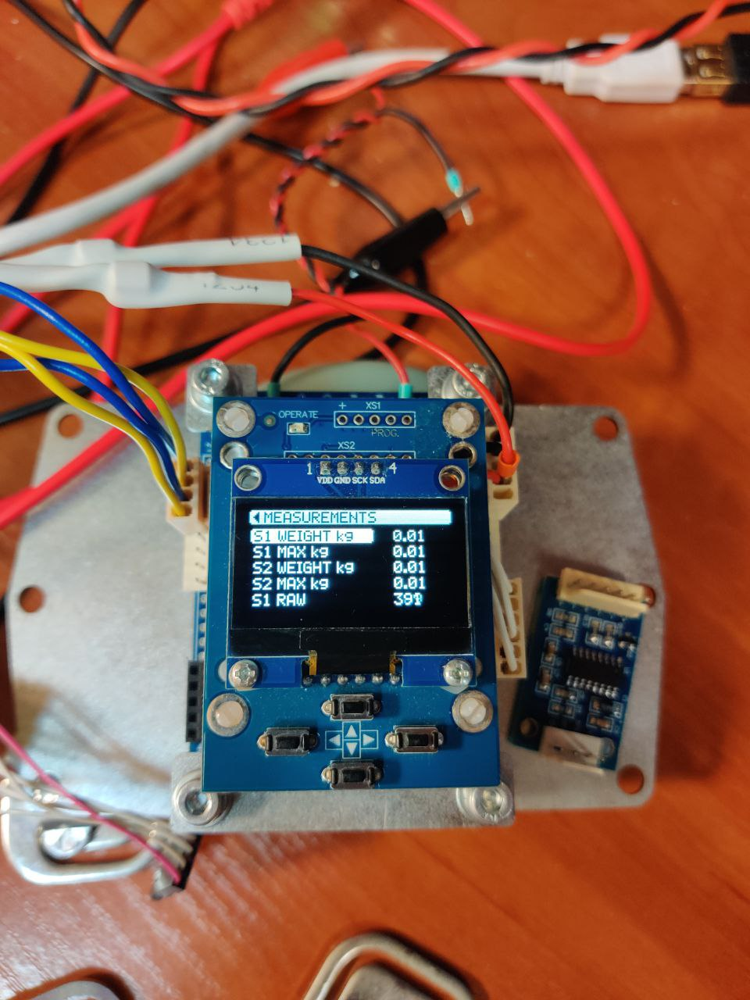

# Turnstile Over-Climb Detection System

This project is an optional module for turnstiles that uses weight sensors to detect attempts of climbing over the cabinet.

---

## Hardware Components
- **PCB703** – STM32-based microcontroller board  
- **HX711 ADC** – used with strain gauge load cells (tensoresistors) for weight measurement  
- **PCB401.02.05 (OLED Display Module)** – used to visualize weight data and the settings menu  
- **Buzzer (BUZZER OUT)** – used for alarm signaling  

---

## MEASUREMENTS PAGE (main page)

- **"S1 WEIGHT kg"** – weight value from the first sensor (in kilograms)  
- **"S1 MAX kg"** – maximum weight value recorded within 30 seconds  
- **"S2 WEIGHT kg"** – weight value from the second sensor (in kilograms)  
- **"S2 MAX kg"** – maximum weight value recorded within 30 seconds  
- **"S1 RAW"** – raw data from the first sensor  
- **"OFFSET"** – zero (tare) value of the first sensor  
- **"S2 RAW"** – raw data from the second sensor  
- **"OFFSET"** – zero (tare) value of the second sensor  

- **"CONFIG PARAMETERS"** – navigates to the configuration parameters page  
- **"INTERFACE INFO"** – navigates to the interface information page  

---

## AVAILABLE CONFIGURATION PARAMETERS PAGE

- **"SYNCHRO MODE"** – synchronization mode between two different controllers  
  - **OFF** – in this mode, the alarm is triggered when the threshold is reached on one cabinet  
  - **ON** – in this mode, the alarm is triggered only when the threshold is reached on both cabinets (via status input and threshold detection)  

- **"TRANSFER MODE"** – data transfer mode between the HX711 sensors and PCB703  
  - **special protocol** – data transfer using a special protocol (green PCB)  
  - **UART protocol** – data transfer using UART (blue PCB, AMOWELL SENSOR)  

- **"THRESHOLD kg"** – sets the trigger threshold value (in kilograms)  
- **"AVERAGING NUM"** – sets the averaging window size  
- **"BUZZER TIME"** – alarm duration (in seconds)  
- **"DATA NORMALIZE TIME"** – signal normalization time (in seconds)  

---

## INTERFACE INFORMATION PAGE

- **"Ch1 RX pkt cnt"** – number of received packets (channel 1)  
- **"Ch1 TX pkt cnt"** – number of transmitted configuration packets (channel 1)  
- **"Ch1 missed pkt cnt"** – number of lost packets (channel 1)  
- **"Ch1 ERR pkt cnt"** – number of corrupted packets (channel 1)  
- **"Ch2 RX pkt cnt"** – number of received packets (channel 2)  
- **"Ch2 TX pkt cnt"** – number of transmitted configuration packets (channel 2)  
- **"Ch2 missed pkt cnt"** – number of lost packets (channel 2)  
- **"Ch2 ERR pkt cnt"** – number of corrupted packets (channel 2)  

